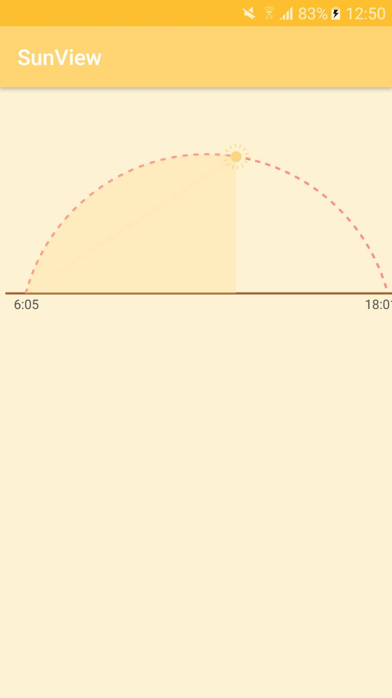

# SunView-lib
It is the Weather View for sunset



# java
```java
sunView=(SunView)findViewById(R.id.sunView);
        sunView.setStartTime("6:05");
        sunView.setEndTime("18:01");
        sunView.setCurrentTime("12:47");
        sunView.setArcSolidColor(getResources().getColor(R.color.ArcSolidColor));//拱型內部顏色
        sunView.setArcColor(getResources().getColor(R.color.ArcColor));//拱形虛線顏色
        sunView.setBottomLineColor(getResources().getColor(R.color.BottomLineColor));//拱形底線顏色
        sunView.setTimeTextColor(getResources().getColor(R.color.TimeTextColor));//字體顏色
        sunView.setSunColor(getResources().getColor(R.color.SunColor));//太陽顏色
```
# xml	
```xml
<com.openweather.sunviewlibrary.SunView
        android:id="@+id/sunView"
        android:layout_width="380dp"
        android:layout_height="wrap_content"
        android:background="#00FFFFFF"
        android:padding="5dp"
        app:arcOffsetAngle="15"
        app:currentTime="12:00"
        tools:ignore="MissingConstraints"
        tools:layout_editor_absoluteX="8dp"
        tools:layout_editor_absoluteY="67dp" />
```
# How to

To get a Git project into your build:

Step 1. Add the JitPack repository to your build file

gradle
maven
sbt
leiningen
Add it in your root build.gradle at the end of repositories:

	allprojects {
		repositories {
			...
			maven { url 'https://jitpack.io' }
		}
	}
Step 2. Add the dependency

	dependencies {
	        compile 'com.github.andy6804tw:SunView-lib:2.0.0'
	}
  
[](https://jitpack.io/#andy6804tw/SunView-lib)
