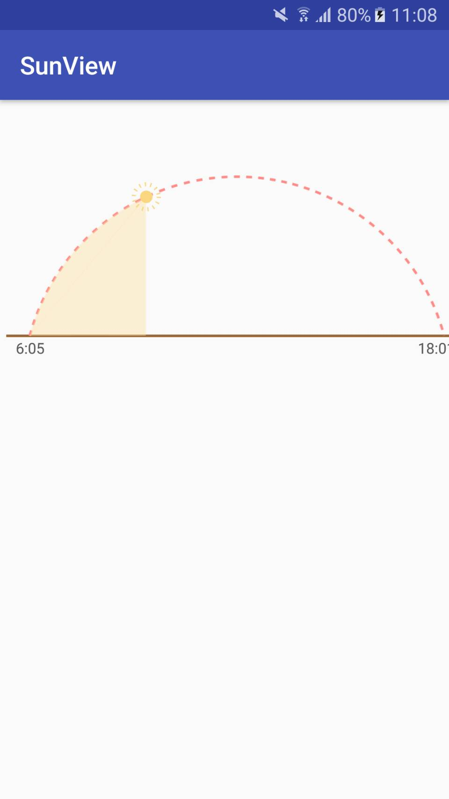

# SunView-lib
It is the Weather View for sunset

How to

To get a Git project into your build:

Step 1. Add the JitPack repository to your build file

gradle
maven
sbt
leiningen
Add it in your root build.gradle at the end of repositories:

	allprojects {
		repositories {
			...
			maven { url 'https://jitpack.io' }
		}
	}
Step 2. Add the dependency

	dependencies {
	        compile 'com.github.andy6804tw:SunView-lib:2.0.0'
	}
  

